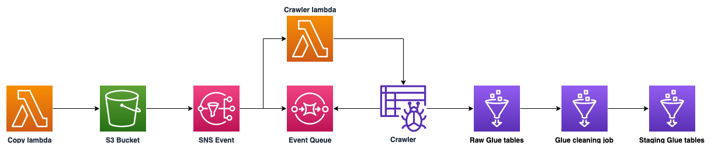

## Antarctica Engineering Task

### Getting started

1. Navigate to the infra directory and run the `terraform init` command.
2. Update the AWS profile in the infra/providers.tf Terraform file. 
3. Run the deploy.sh script.
4. Invoke the copy lambdas using the following commands:

```
aws lambda invoke \
    --function-name fund_data_fund_prices_copy_lambda \
    --payload '{}' \
    --region eu-west-1 \
    response.json


aws lambda invoke \
    --function-name fund_data_fund_details_copy_lambda \
    --payload '{}' \
    --region eu-west-1 \
    response.json
```

### Architecture

The architecture for each data source is as follows



1. A lambda function copies the S3 objects to S3.
2. The S3 put event send a message to an SNS topic.
3. The SNS topic trigger a lambda function and sends a message to an SQS queue.
4. The triggered lambda function starts a glue crawler.
5. The crawler creates a glue catalog table in the raw database.
6. Once the crawler finishes a glue job is triggered which cleans the data.
7. The cleaning job creates new files in S3 and a table in the staging database.

### Code

Infrastructure: A Terraform map variable is employed to represent each dataset: fund details and fund prices. A loop is used to re-use terraform resource blocks where possible.

Application: Python is used to define both the lambda functions and glue jobs. There are two lambda which follow SRP principles. The glue jobs also utilise the glue modules python module to further abstract common functions.

### Accessing the data

Once the Glue tables are defined in the Glue catalog they can be accessed using Athena.

### TBC

The final job which joins the two datasets is hasn't been completed.
